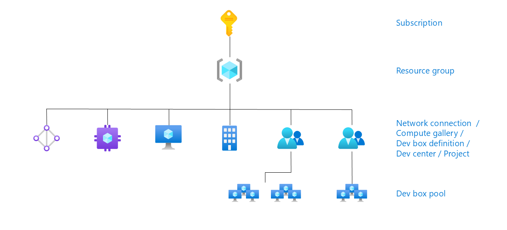

# Contoso Dev Box Use Case

Welcome to the Contoso Dev Box repository! This project showcases how Contoso, a fictitious company with developers located worldwide, leverages Microsoft Dev Box to streamline its engineer onboarding and deployment environment automation processes.

## Table of Contents
- [Overview](#overview)
- [Key Benefits](#key-benefits)
- [Microsoft Dev Box](#microsoft-dev-box)
  - [Overview](#overview-1)
  - [Key Features](#key-features)
  - [Benefits for Developers](#benefits-for-developers)
  - [Enhancing Developer Experience](#enhancing-developer-experience)
  - [Adding Platform Capabilities](#adding-platform-capabilities)
  - [Pre-Requisites](#pre-requisites)
- [Contoso Dev Box Solution Architecture](#contoso-dev-box-solution-architecture)
  - [Step-by-Step Workflow](#step-by-step-workflow)
  - [Workflow Summary](#workflow-summary)
- [Deploying Contoso Dev Box Solution to Azure](#deploying-contoso-dev-box-solution-to-azure)
  - [Step-by-Step Deployment Guide](#step-by-step-deployment-guide)
    - [Step 1: Fork this repo and the other repos used for Demo](#step-1-fork-this-repo-and-the-other-repos-used-for-demo)
    - [Step 2: Create your GitHub Access Token](#step-2-create-your-github-access-token)
    - [Step 3: Create your local Environment Configuration using AZD](#step-3-create-your-local-environment-configuration-using-azd)
    - [Step 4: Update the .env file of your environment adding the KEY_VAULT_SECRET variable](#step-4-update-the-env-file-of-your-environment-adding-the-key_vault_secret-variable)
    - [Step 5: Run the setUp.ps1 PowerShell script](#step-5-run-the-setup.ps1-powershell-script)
    - [Step 6: Deploy the solution to Azure with AZD](#step-6-deploy-the-solution-to-azure-with-azd)
    - [Step 7: Follow the deployment steps until its completed](#step-7-follow-the-deployment-steps-until-its-completed)
    - [Step 8: Test the solution](#step-8-test-the-solution)
  - [Conclusion](#conclusion)

## Overview

Contoso aims to enhance its engineering efficiency by adopting Microsoft Dev Box. This repository demonstrates how Contoso designed and deployed its solution, enabling remote engineers to quickly and effectively set up their development environments.

## Key Benefits

- **Streamlined Onboarding**: New engineers can get started quickly with pre-configured development environments.
- **Automated Deployment**: Simplifies the process of setting up and managing deployment environments.
- **Global Accessibility**: Ensures that developers from any location can access the necessary tools and resources.
- **Platform Engineering Capabilities**: Platform engineers can create dev box pools, manage security settings, network configurations, and organizational policies to ensure secure access to resources [here](https://learn.microsoft.com/en-us/azure/dev-box/overview-what-is-microsoft-dev-box).

Explore the repository to learn more about how Contoso utilizes Microsoft Dev Box to achieve these goals.

# Microsoft Dev Box

## Overview
Microsoft Dev Box is a cloud-based service that provides developers with self-service access to high-performance, preconfigured, and ready-to-code workstations. These dev boxes are designed to streamline development workflows by offering customizable environments tailored to specific project needs.

## Key Features
- **Self-Service Access**: Developers can quickly provision dev boxes on demand, reducing setup time and increasing productivity.
- **High-Performance Workstations**: Dev boxes are equipped with powerful hardware and software configurations to handle demanding development tasks.
- **Preconfigured Environments**: Dev boxes come with tools, source code, and prebuilt binaries specific to a project, allowing developers to start coding immediately.
- **Customizable Images**: Use preconfigured images from Azure Marketplace or create custom images with specific tools and configurations.
- **Integration with Azure**: Seamlessly integrates with Azure services, enabling secure access to resources and efficient management of development environments.
- **Multi-Project Support**: Developers can create multiple dev boxes to work on different projects or tasks simultaneously.

## Benefits for Developers
- **Increased Productivity**: Reduce setup time and start coding faster with ready-to-use environments.
- **Flexibility**: Easily switch between projects and tasks by provisioning multiple dev boxes.
- **Enhanced Collaboration**: Share dev boxes with team members to ensure consistent development environments.
- **Cost Management**: Control costs with auto-stop schedules and efficient resource allocation.

## Enhancing Developer Experience
Microsoft Dev Box significantly enhances the developer experience by providing a seamless, responsive, and efficient environment that feels like working on a local machine. Developers benefit from:
- **Optimized Workflows**: Preconfigured environments reduce setup time and allow developers to focus on coding.
- **Improved Onboarding**: New developers can quickly get up to speed with ready-to-code workstations.
- **Consistent Environments**: Ensures all team members work in identical environments, reducing "it works on my machine" issues.

## Adding Platform Capabilities
For companies, Microsoft Dev Box adds robust platform capabilities by:
- **Centralized Management**: IT admins can manage dev boxes like any other device on the network, ensuring security and compliance.
- **Scalability**: Easily scale development environments up or down based on project needs.
- **Cost Efficiency**: Optimize resource usage and control costs with auto-stop schedules and efficient resource allocation.
- **Enhanced Security**: Built-in security features and compliance with industry standards ensure that development environments are secure.

Microsoft Dev Box bridges the gap between development teams and IT, bringing control of project resources closer to the development team and enhancing overall productivity.

For more information, visit the [Microsoft Dev Box documentation](https://learn.microsoft.com/en-us/azure/dev-box/overview-what-is-microsoft-dev-box).

## Pre-Requisites

Before deploying the Microsoft Dev Box solution to your Azure subscription, ensure you have the following prerequisites in place:

1. **Azure Subscription**: An active Azure subscription. If you don't have one, you can create a free account [here](https://learn.microsoft.com/en-us/microsoft-365/enterprise/subscriptions-licenses-accounts-and-tenants-for-microsoft-cloud-offerings?view=o365-worldwide).

2. **Azure CLI**: Install the Azure CLI. You can download and install it from [here](https://learn.microsoft.com/en-us/cli/azure/install-azure-cli).

3. **Azure Developer CLI**: Install the Azure Developer CLI. You can find the installation instructions [here](https://learn.microsoft.com/en-us/azure/developer/azure-developer-cli/install-azd?tabs=winget-windows%2Cbrew-mac%2Cscript-linux&pivots=os-windows).

4. **Bicep**: Install Bicep, a domain-specific language (DSL) for deploying Azure resources. Installation instructions are available [here](https://learn.microsoft.com/en-us/azure/azure-resource-manager/bicep/install).

5. **RBAC Roles**: Ensure you have the following roles assigned in your Azure subscription. For more details click [here](https://learn.microsoft.com/en-us/azure/dev-box/concept-dev-box-role-based-access-control):



6. **Microsoft Entra ID**: Your organization must use Microsoft Entra ID (formerly Azure Active Directory) for identity and access management. More information can be found [here](https://learn.microsoft.com/en-us/azure/dev-box/).

7. **Microsoft Intune**: Your organization must use Microsoft Intune for device management. More details are available [here](https://learn.microsoft.com/en-us/mem/intune/fundamentals/what-is-intune).

8. **User Licenses**: Ensure each user has the necessary licenses:
   - [Windows 11 Enterprise or Windows 10 Enterprise](https://learn.microsoft.com/en-us/azure/dev-box/quickstart-configure-dev-box-service)
   - [Microsoft Intune](https://learn.microsoft.com/en-us/azure/dev-box/quickstart-configure-dev-box-service)
   - [Microsoft Entra ID P1](https://learn.microsoft.com/en-us/azure/dev-box/quickstart-configure-dev-box-service)

   These licenses are included in subscriptions like Microsoft 365 F3, E3, E5, A3, A5, Business Premium, and Education Student Use Benefit. More details can be found [here](https://azure.microsoft.com/en-us/pricing/details/dev-box/).

9. **Register Resource Provider**: Register the `Microsoft.DevCenter` resource provider in your Azure subscription. Instructions can be found [here](https://learn.microsoft.com/en-us/azure/dev-box/).

By ensuring these prerequisites are met, you'll be ready to deploy the Microsoft Dev Box solution to your Azure subscription.

# Contoso Dev Box Solution Architecture

The Contoso Dev Box solution is designed to streamline the Engineer onboarding process for various projects using Microsoft Dev Box. Below is a detailed step-by-step description of the solution architecture, accompanied by the provided Solution Architecture Picture.


## Step-by-Step Workflow

1. **Contoso Engineering Teams (Developers, QA, SRE, Operations)**
   - Engineers from different teams such as Developers, QA, SRE (Site Reliability Engineering), and Operations are depicted at the top left of the diagram.
   - These engineers need access to development environments to work on their respective projects.

2. **Azure Environment**
   - The entire solution is hosted within Azure.

3. **Contoso Product Team**
   - There are multiple instances of Contoso Product Teams shown in separate boxes within Azure.
   - Each product team has its own set of resources including:
     - **PR Pipelines/Repos**: These are repositories and pipelines for managing code and continuous integration/continuous deployment (CI/CD) processes.
     - **Virtual Machines**: Virtual machines that provide isolated development environments for engineers.
     - **Dev Boxes**: Specific development environments tailored for each engineer's needs.

4. **Contoso Dev Box Service**
   - This service acts as a central hub for managing all Dev Boxes across different product teams.
   - Key components include:
     - **Projects**: Different projects that engineers are working on.
     - **Dev box definition**: Templates or configurations defining what a Dev Box should contain.
     - **Dev box pool**: A collection of available Dev Boxes ready to be assigned to engineers.

5. **Connections Layer (Onboarding Layer)**
   - This layer facilitates connections between various components:
     - Engineers connect through this layer to access their assigned Dev Boxes based on project requirements.

6. **Additional Azure Services**
   - Several additional services support the overall infrastructure:
     - **Azure Active Directory (AAD)**: Manages user identities and access control.
     - **Billing & Cost Management**: Tracks usage and costs associated with running virtual machines and other resources.
     - **Security Center**: Ensures security compliance and monitors potential threats within the environment.
     - **Automation Accounts**: Automates repetitive tasks such as provisioning new Dev Boxes or scaling resources up/down based on demand.

## Workflow Summary
1. Engineers from various teams request access to development environments through Contoso's onboarding process facilitated by Azure.
2. The Contoso Dev Box Service manages the allocation and configuration of Dev Boxes based on project requirements.
3. Engineers connect to their assigned Dev Boxes through the Connections Layer.
4. Additional Azure services ensure security, cost management, and automation within the environment.

# Deploying Contoso Dev Box Solution to Azure

## Step-by-Step Deployment Guide

### Step 1: Fork this repo and the other repos used for Demo
- [DevExp-DevBox](https://github.com/evilazaro/devexp-devbox/)
- [IdentityProvider](https://github.com/evilazaro/identityprovider/)
- [eShop](https://github.com/evilazaro/eshop)

### Step 2: Create your GitHub Access Token
[Managing your personal access tokens - GitHub Docs](https://docs.github.com/en/authentication/keeping-your-account-and-data-secure/managing-your-personal-access-tokens)

### Step 3: Create your local Environment Configuration using AZD
```powershell
azd env new prod
```
### Step 4: Update the .env file of your environment adding the KEY_VAULT_SECRET variable
```file
KEY_VAULT_SECRET="<YOUR GITHUB ACCESS TOKEN>"
```
### Step 5: Run the setUp.ps1 PowerShell script
```powershell
.\setUp.ps1
```
### Step 6: Deploy the solution to Azure with AZD
```powershell
azd provision -e prod
```

### Step 7: Follow the deployment steps until its completed
### Step 8: Test the solution 

# Conclusion
By following these steps, you will have successfully deployed the Contoso Dev Box solution to Azure. Ensure to monitor and manage the Dev Boxes regularly to optimize performance and security.