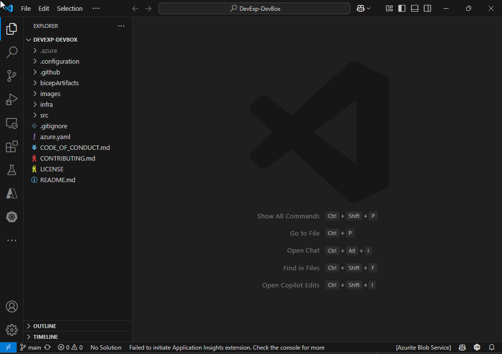
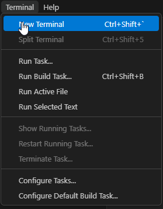
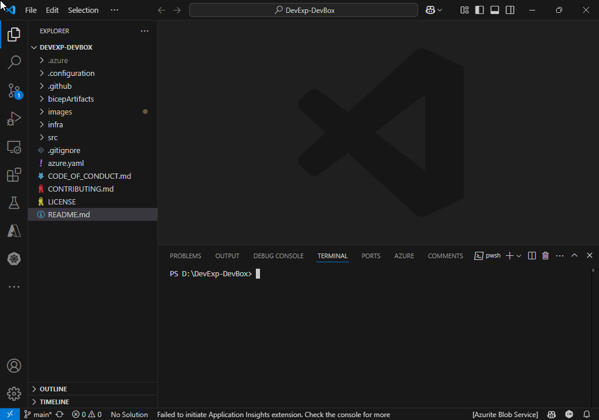
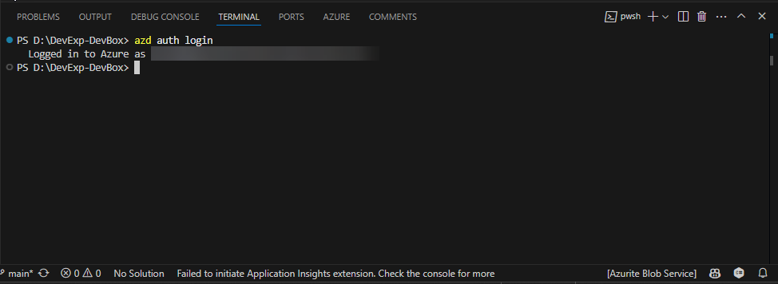
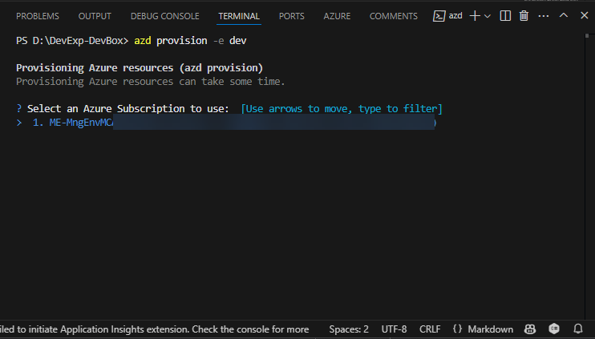
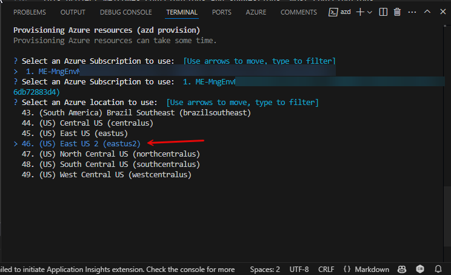
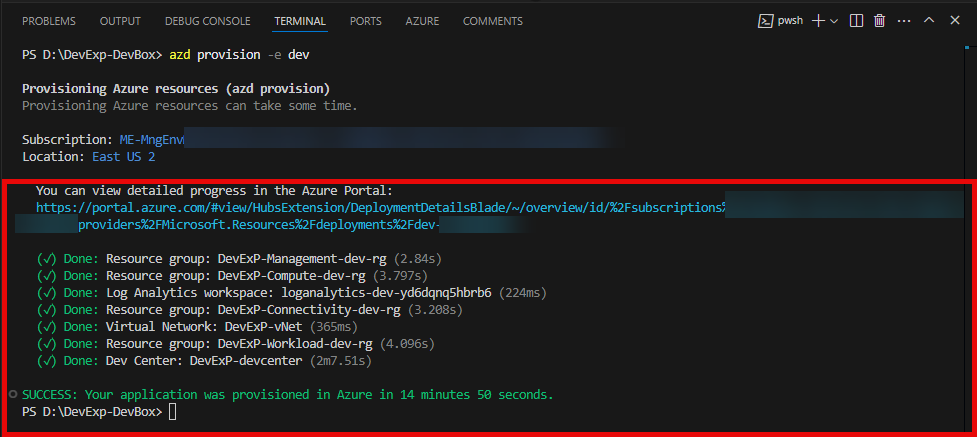

# Dev Experience with Microsoft DevBox

Example templates and customization configurations for Dev Box and Azure Deployment Environments.

## Table of Contents

- [Solution Architecture](#solution-architecture)
- [Pre-requisites](#pre-requisites)
  - [Install Git](#install-git)
  - [Install Visual Studio Code](#install-visual-studio-code)
  - [Install Azure Developer CLI](#install-azure-developer-cli)
- [Get Started](#get-started)
  - [Deploy Solution](#deploy-solution)
    - [Clone this Repo](#clone-this-repo)
    - [Open VS Code](#open-vs-code)
    - [Open a new Terminal](#open-a-new-terminal)
    - [Login to Azure](#login-to-azure)
    - [Create your environment](#create-your-environment)
    - [Provision the solution](#provision-the-solution)
  - [Create a DevBox](#comingsoon)
  - [Create a Deployment Environment](#comingsoon)
- [Contributing](#contributing)
- [Trademarks](#trademarks)
- [License](#license)

## Solution Architecture


## Pre-requisites

Before getting started, ensure you have the following tools installed on your Windows machine. You can use `winget` to install them quickly.

### Install Git

Git is required for cloning the repository.

```powershell
winget install --id Git.Git -e --source winget
```

### Install Visual Studio Code
VS Code is used for editing and running scripts.

```powershell
winget install --id Microsoft.VisualStudioCode -e --source winget
```

### Install Azure Developer CLI
Azure Developer CLI (azd) is required to interact with Azure services.

```powershell
winget install --id Microsoft.AzureCLI -e --source winget
```

## Get Started

### Deploy Solution

#### Clone this Repo

```powershell
git clone https://github.com/Evilazaro/DevExp-DevBox.git
```

#### Open VS Code
```powershell
cd DevExp-DevBox

code .
```

You are going to see VS Code with all the content of this repo



#### Open a new Terminal

Click on Terminal Menu >> New Terminal



Your Visual Studio Code must be like the image below



#### Login to Azure

Type the command below into the Terminal Window and press enter
```
azd auth login
```
Provide your Azure Credentials.

After the login to Azure has been completed, you must see the following message below:



#### Create your environment
```powershell
azd new env dev
```

You are going to see a new *.azure* folder with the *dev environment* configuration that will be used by Azure Developer CLI.


#### Provision the solution
```powershell
azd provision -e dev
```
Select the Azure Subscription you want to deploy the workload to and press Enter.



Select the Azure Region you want to deploy the workload to and press Enter.



Azure Develper CLI will start the deployment to your Azure Subscription. When the deployment is finished, you must see the following message:



## Contributing

This project welcomes contributions and suggestions. Most contributions require you to agree to a Contributor License Agreement (CLA) declaring that you have the right to, and actually do, grant us the rights to use your contribution. For details, visit [https://cla.opensource.microsoft.com](https://cla.opensource.microsoft.com).

When you submit a pull request, a CLA bot will automatically determine whether you need to provide a CLA and decorate the PR appropriately (e.g., status check, comment). Simply follow the instructions provided by the bot. You will only need to do this once across all repos using our CLA.

This project has adopted the [Microsoft Open Source Code of Conduct](https://opensource.microsoft.com/codeofconduct/). For more information see the [Code of Conduct FAQ](https://opensource.microsoft.com/codeofconduct/faq/) or contact [opencode@microsoft.com](mailto:opencode@microsoft.com) with any additional questions or comments.

## Trademarks

This project may contain trademarks or logos for projects, products, or services. Authorized use of Microsoft trademarks or logos is subject to and must follow [Microsoft's Trademark & Brand Guidelines](https://www.microsoft.com/en-us/legal/intellectualproperty/trademarks/usage/general). Use of Microsoft trademarks or logos in modified versions of this project must not cause confusion or imply Microsoft sponsorship. Any use of third-party trademarks or logos are subject to those third-party's policies.

## License

This project is licensed under the [MIT License](LICENSE).